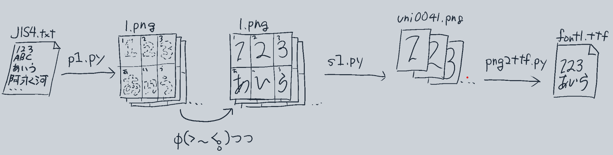

<h1>tegakiFontBuilder</h1>
    おおまかな流れ
    
    

        
        
    

## 説明
手書きフォントの作成を支援するツールです
|.py|説明|
|---|---|
|p1.py|テキストファイルから下書き用の文字表を作る|
|s1.py|書き終わった文字表を一文字ずつ画像に分割する|
|png2ttf.py|画像からフォントを作る~

文字表をつくるp1.py、文字表を分解するs1.py、画像をフォントに変換するpng2ttf.pyという3つのコードから構成されています。
png2ttf.pyについては、通常のpythonではなく、fontforgeのpythonバインドを使った、ffpythonコマンドにより実行するため、pythonとは別にpathを通してffpythonコマンドを使えるようにするか、fontforge付属のconsole.batから実行する必要があり、環境構築が若干面倒です。

## 使い方
### 準備
- このリポジトリをダウンロードする
- pythonが使えるコマンドラインを開く
  - anacondaをインストールし、anaconda promptを起動する
  - または
  - anacondaをインストールし、パソコンにパスを通してコマンドプロンプトを起動する
### 文字表をつくる
- p1.pyの中にあるフォントファイルのパスを、自分が持っているフォントに書き換える
- anaconda promptまたはコマンドプロンプトで、ダウンロードしてきたこのリポジトリに移動し、python p1.pyなどと打ってp1.pyを実行しtxtファイルから文字表のpng画像を作る
~~~shell
cd download/tegakiFontBuilder
python p1.py
~~~
### 文字表をなぞる（大変）
- イラストソフト等で文字表を参考に文字を書き、文字表のpng画像に上書き保存する
### フォントをつくる
- s1.pyを実行し、文字表を文字ごとに分割する
~~~shell
python s1.py
~~~
- png2ttf.pyを実行し文字の画像からttfフォントをビルドする(fontforgeのfontforge console.batからffpythonコマンドで実行)
~~~fontforge console
ffpython png2ttf.py
~~~

## 追記
png2ttfの使い方はこっちの方が丁寧に書いてあります
https://github.com/Mikanixonable/png2ttf

## 付録
JIS.txt. 
常用漢字とかひらがなとかが入っているテキストファイル
