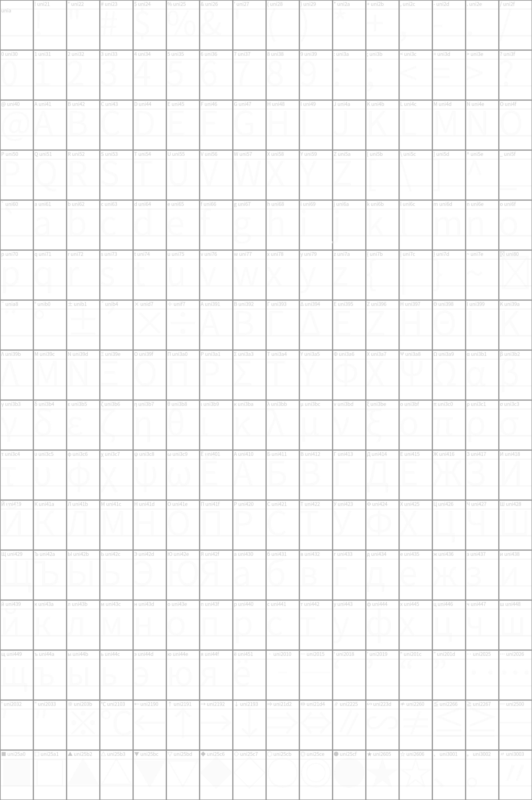
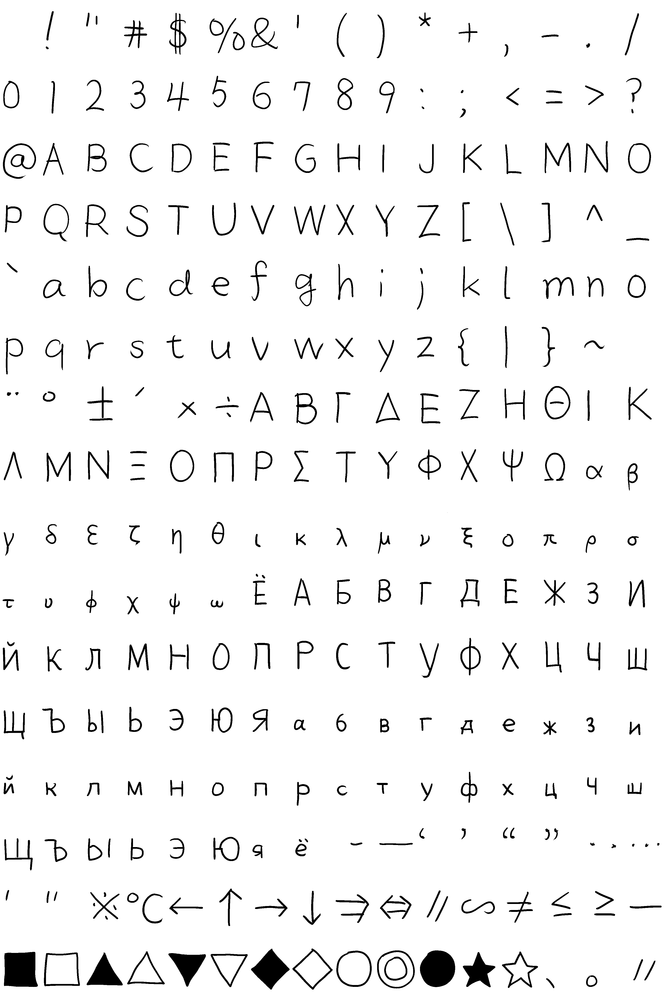

<html>

<body>
    <h1>tegakiFontBuilder</h1>
    

        
        
    

<h3>使い方</h3>

p1.pyを実行しtxtファイルから文字表のpng画像を作る 

イラストソフト等で文字表を参考に文字を書き、文字表のpng画像に上書き保存

s1.pyを実行し、文字表を文字ごとに分割する

png2ttf.pyで文字の画像からttfフォントをビルドする

<h3>付録</h3>

JIS.txt

常用漢字とかひらがなとかが入っているテキストファイル

</body>
</html>
